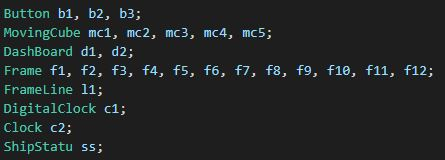
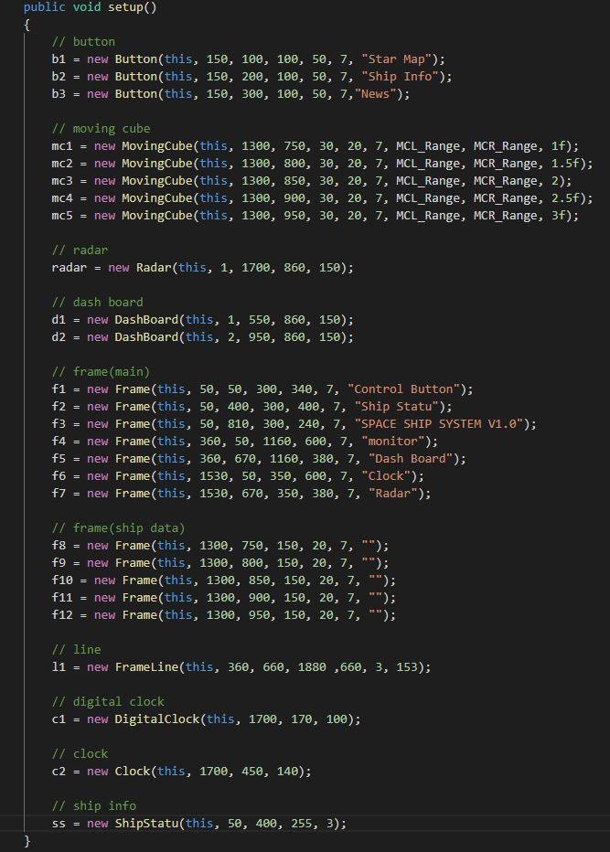
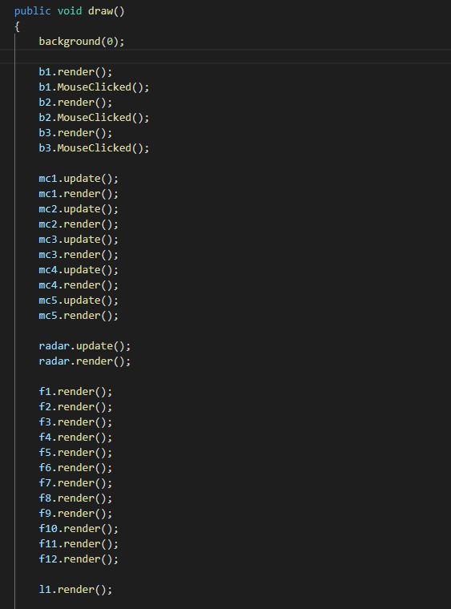
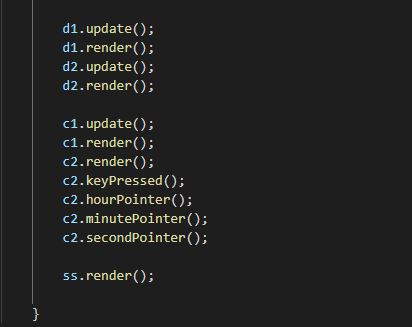
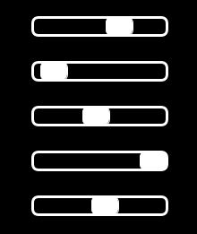
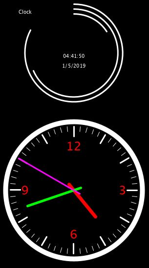

# SciFi UI Project

Name: Zhimian Wu

Student Number: D16123932

# Description of the assignment
I have created an interface of a space ship system, there are some tools on it. Like buttons, first is to open the star map, second is to check the ship statu and the third is to see the news from Space Radio Station. Under those buttons is the infomation map of the spaceship. On the left bottom side is the version of this system. As you can see, I create a monitor on the center, it's big enough and can display manythings like star map, news etc.. On the bottom side you can see there is a dashboard but kind weird. On the right side, I add two different type of clock, one is a normal clock, on is a digital clock feels like a clock that appear in some science moive. And last one is the radar, hope it help the users to keep dangar away.

# Instructions
You can Press LEFT to stop the second clock and Press RIGHT to let the clock work again, I also add three buttons on the left side in the button frame, if you click those buttons , the buttons will get gray but nothing will happene, I tried but I have some problems working on let the button realize its proper function.

# How it works
Botton Class:
 Import PApplet to get text from UI and display it on the button.
 button(x, y, width, height, radius, text).
 (x,y) to set the coordinates of button in the UI, (width, height) is the width and height of the botton, same like two variable to control the size of button. (radius) make the corners smooth and (text) is the text that will display on the center of the button.

MovingCube Class:
 MovingCube(x, y, width, height, radius, speed, L_range, R_range),
 (x, y) to set the coordinates in the UI, (width, height) to control the size of cube, (radius) to make the corners smooth, (speed) to control the move speed of every cube. Set MCL_Range(moving cube left range) and MCR_Range(moving cube right range) in UI to control the cube would not get out of the frame (L_range, R_range). Add update function to control cube move in the frame.

DashBoard Class:
 Import PApplet get PI value and PVector to set the (x,y) coordinates. 
 DashBoard (frequncy, x, y, radius)
 PVector (x, y) also control the rotation of the line. (frenquncy) to control the rotation speed, update function to make (x2, y2) become dynamic variables so the result like a loop.

Frame Class:
 Import PApplet to get text from UI and display name of each frame.
 Frame(x, y, width, height, radius, text).
 Function same like the button class, only thing different is I changed the text display place.

FrameLine Class:
 Frame(x1, y1, x2, y2, no, color)
 (x1, y1, x2, y2) is used to set variable in the line(), (no) controls the strokeWeight and color controls the line color.

DigitalClock Class:
 Import PApplet to get map function working in the update() and some other functions like second() to run normally.
 DigitalClock(x, y, radius)
 In the render function I used sc, mn ,hr to get the value of second(), minute(), hour().
 String to controls the format to display time, use arc() to simulate the change of digital time.
 Map function to obtaining the mapping value corresponding to time.
 time to control the frameRate.

Clock Class:
 Import PApplet to make the functions of time class running normally.
 Clock(x, y, radius).
 use array to store the time value, use pushMatrix() and translate() to move the starting point of coordinate system to where I want and rotate() to draw the clock face  and the scale on the clock face, then popMatrix() will reset the coordinate point of UI. keyPressed() function to control the boolean variable (flag) and by control flag equal to true or false to control the clock work or not.
 Also use pushMatrix(), rotate() and popMatrix to help me build the clock by writting hourPointer(), minutePointer() and secondPointer().

ShipStatu Class:
 This class I was planning to use PVector and ArrayList to build a dynamic data graph but failed.
 Import PApplet to get map() running normally.
 ShipStatu(x, y, color, no)
 Use pushMatrix(), translate() and popMatrix to reduce workload. Map function to get mapping value of each string in array and draw it.


# What I am most proud of in the assignment
I use two kinds of ways add two different type of clock in to the interface, one is using map function to control the clock working, the other one is using pushMatrix() and popMatrix to control the rotation of second pointer, minute pointer and hour pointer. rotate() also helps me to draw the clock. Also you can press LFET or RIGHT on the keyboard see what happened.

# Markdown Tutorial

This is my project Java File list

- Main.java
- UI.java
- Button.java
- MovingCube.java
- DashBoard.java
- Frame.java
- FrameLine.java
- DigitalClock.java
- Clock.java
- ShipStatu.java

This is calling other class in UI:









# SciFi UI Project Code

## UI.java

UI is the main body of the whole project, it can also help you understan how the java package working and how to call other class and running in this main java program.

Those links might help you to understand how it working.

- [Class attributes](https://www.w3schools.com/java/java_class_attributes.asp)
- [Methods](https://www.w3schools.com/java/java_class_methods.asp)
- [Constructors](https://www.w3schools.com/java/java_constructors.asp)
- [Package](https://www.w3schools.com/java/java_packages.asp)
- [Inheritance](https://www.w3schools.com/java/java_inheritance.asp)
- [Polymorphism](https://www.w3schools.com/java/java_polymorphism.asp)

## Button.java

Button is the sub-class that I create to build button in UI.

Here is the code how I draw a button without specifying the language:

```
public void render()
{
    ui.noFill();
    ui.stroke(255);
    ui.strokeWeight(2);
    ui.rect(x, y, width, height, radius);
    ui.fill(255);
    ui.textAlign(PApplet.CENTER, PApplet.CENTER);
    ui.text(text, x + width * 0.5f, y + height * 0.5f);
    ui.strokeWeight(1);
}
```

[An image](images/button.png)

## MovingCube.java

I create this class to make the UI look more like a UI of space ship.

Here is the code I used to control the speed of each object:

```Java
public void update()
{
    x += speed;
    if ((x > R_range - width) || (x < L_range))
    {
        speed *= -1;
    }
}
```



## DashBoard.java

As for the dashboard, I used PVector() to control the coordinate and also control the rotation of the line in the circle.

Code without specifying the language:

```
public void render()
{
    ui.noFill();
    ui.strokeWeight(3);
    ui.ellipse(pos.x, pos.y, radius * 2, radius * 2);
    float x2 = pos.x + (float) Math.sin(theta) * radius;
    float y2 = pos.y - (float) Math.cos(theta) * radius;
    ui.line(pos.x, pos.y, x2, y2);
    ui.strokeWeight(1);
}
```

Also use a TimeDelta value to control the frameRate.

```Java
float timeDelta = 1.0f / 60.0f;

public void update()
{

    theta += PApplet.PI * timeDelta * frequency;
}
```

Those link might help you understan how the PVector working.

- [PVector](https://processing.org/reference/PVector.html)

[](https://www.youtube.com/playlist?list=PLRqwX-V7Uu6ZwSmtE13iJBcoI-r4y7iEc) 

## Clock

This object code is more complexity, I used popMatrix(), pushMatrix() to draw the (x, y) and rotate() helps me a lot on draw the clock face and also draw the scale on the clock face.

And a function to press LEFT or RIGHT on keyboard to control the clock. 

This is code without specifying the language:

```
public void render()
    {
        time[0] = second();
        time[1] = minute();
        time[2] = hour();
        timeFloat[0] = (float) (minute() + time[0] / 60.0); // current minute
        timeFloat[1] = (float) (hour() + time[1] / 60.0); // current hour

        ui.ellipseMode(CENTER);
        ui.stroke(255);
        ui.strokeWeight(10);
        ui.fill(0);
		ui.ellipse(x, y, radius * 2, radius * 2);
		// draw clock
        for(int i = 1 ; i <= 60 ; i ++)
        {
            ui.pushMatrix();
            ui.translate(x, y);
            ui.rotate(radians(i * 6));
            if(i % 5 == 0)
            {
                ui.strokeWeight(3);
                ui.line(110, 0, 130, 0);
            }
            else
            {
                ui.strokeWeight(1);
                ui.line(120, 0, 130, 0);
            }
            ui.popMatrix();
        }
        ui.textSize(25);
        ui.fill(255, 0, 0);
        ui.stroke(255);
        ui.strokeWeight(1);
        ui.text(12, 1700, 345); // 12 o'clock
        ui.text(3, 1800, 435); // 3 o'clock
        ui.text(6, 1700, 525); // 6 o'clock
        ui.text(9, 1600, 435); // 9 o'clock
        ui.textSize(10);
    }
}
```

This is the keyPressed() code and Pointer code without specifying the language:

```
public void keyPressed()
    {
        if(ui.checkKey(LEFT))
        {
            flag = false;
            System.out.println("Stop");
        }
        else if(ui.checkKey(RIGHT))
        {
            flag = true;
            System.out.println("Start");
        }   
    }

    public void hourPointer()
    {
        // hour pointer
        // 12 hours -> 360 degree, 1 hour -> 30 degree
        ui.pushMatrix();
        ui.translate(x, y);
        float angleHour = radians(270);
        if((timeFloat[1] >= 3 && timeFloat[1] <= 12) || (timeFloat[1] >= 15 && timeFloat[1] <= 24))
        {
            angleHour = radians(30 * (timeFloat[1] - 3));
        }
        else
        {
            angleHour = radians(30 * (timeFloat[1] - 1) + 300);
        }
        if (flag) 
        {
            ui.rotate(angleHour);
        } 
        else 
        {
            ui.rotate(radians(270));
        }
        ui.stroke(255, 0, 0);
        ui.strokeWeight(7);
        ui.line(-15, 0, 70, 0);
        ui.popMatrix();
    }

    public void minutePointer()
    {
        // minute pointer
        // 60 minutes -> 360 degree, 1 minute -> 6 degree
        ui.pushMatrix();
        ui.translate(x, y);
        float angleMinute = radians(270);
        if((timeFloat[0] >= 0 && timeFloat[0] <= 15))
        {
            angleMinute = radians(270 + 6 * timeFloat[0]);
        }
        else
        {
            angleMinute = radians(6 * (timeFloat[0] - 15));
        }
        if (flag) 
        {
            ui.rotate(angleMinute);
        } 
        else 
        {
            ui.rotate(radians(270));
        }
        ui.stroke(0, 255, 0);
        ui.strokeWeight(5);
        ui.line(-15, 0, 100, 0);
        ui.popMatrix();
    }

    public void secondPointer()
    {
        // second pointer
        // 60 seconds -> 360 degree, 1 second -> 6 degree
        ui.pushMatrix();
        ui.translate(x, y);
        float angleSecond = radians(270);
        if ((time[0] >= 0 && time[0] <= 15)) 
        {
            angleSecond = radians(270 + 6 * time[0]);
        } else 
        {
            angleSecond = radians(6 * (time[0] - 15));
        }
        if (flag) 
        {
            ui.rotate(angleSecond);
        } 
        else 
        {
            ui.rotate(radians(270));
        }
        ui.stroke(255, 0, 255);
        ui.strokeWeight(3);
        ui.line(-15, 0, 130, 0);
        ui.fill(255, 0, 0);
        ui.stroke(255);
        ui.popMatrix();
    }
```



Those links might helps you to undertand how it works:
- [pushMatrix](https://processing.org/reference/pushMatrix_.html)
- [popMatrix](https://processing.org/reference/popMatrix_.html)
- [popMatrix Video](https://www.youtube.com/watch?v=OaBSHuP4xcE&t=573s)


This is my project youtube video:

[](https://youtu.be/VDyNSID38Qg)

